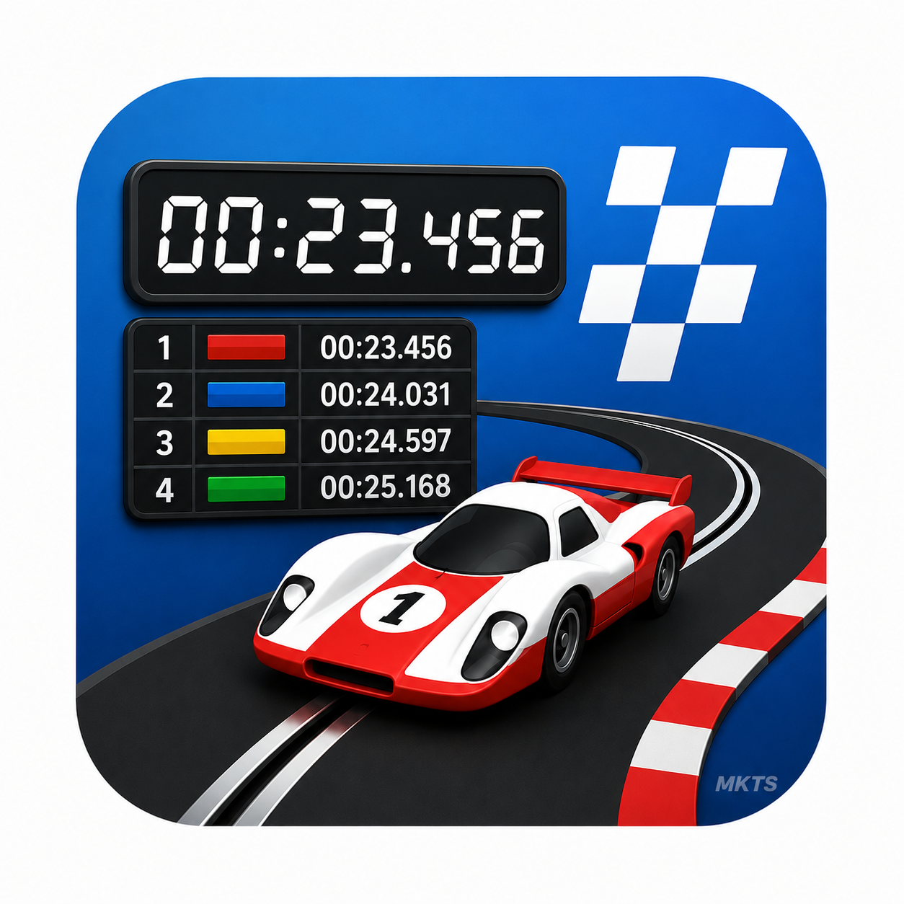
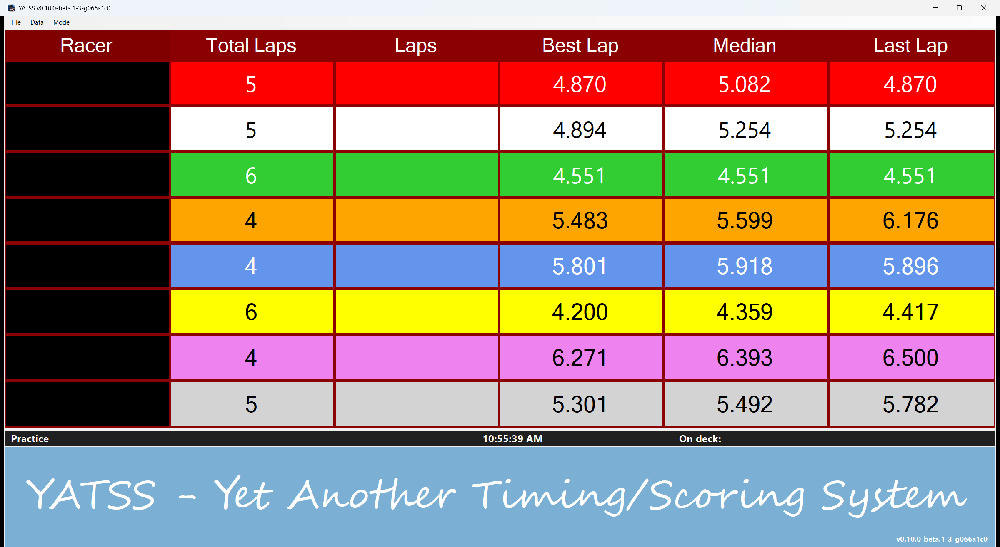
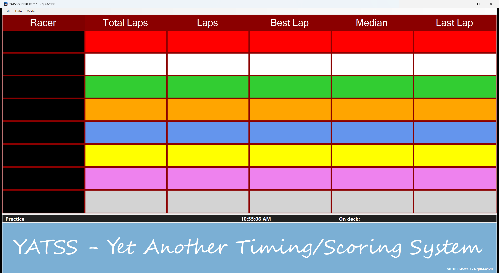
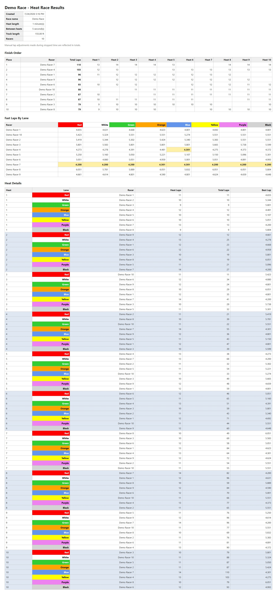

# YATSS



YATSS is an open-source slot-car lap timing and race-control system. A Windows
race board handles lap scoring, qualifying, heat rotation, reports, backups,
and operator workflow. An ESP32 controller timestamps sensor edges and controls
up to eight lane-power relays.

[](docs/images/yatss-demo-race-heat-2.png)

> **Public beta:** `v0.10.0-beta.1` is intended for evaluation, demo races, and
> careful bench testing. YATSS has no production track installations yet.

## Download and Try It

Download a Windows x64 ZIP from
[GitHub Releases](https://github.com/tekrantz57/YATSS/releases):

- `YATSS-win-x64-v0.10.0-beta.1.zip` is self-contained and does not require a
  separately installed .NET runtime.
- `YATSS-win-x64-requires-dotnet10-v0.10.0-beta.1.zip` is smaller and requires
  the x64 .NET 10 Desktop Runtime.
- `YATSS-win-arm64-v0.10.0-beta.1-experimental.zip` is a self-contained,
  experimental Windows ARM64 build.

1. Verify the downloaded ZIP using its attached SHA-256 checksum.
2. Extract the complete ZIP to a writable folder.
3. Run `YATSSWin.exe`.
4. Select `Mode > Demo Race...`; it starts Simulated Lap Input automatically so
   the race can run without controller hardware.

The executable is not code-signed, so Windows may show a reputation warning for
the prerelease. Verify the GitHub source and checksum before running it.

## Screenshots

<table>
  <tr>
    <th>Simulated practice</th>
    <th>Idle timing board</th>
  </tr>
  <tr>
    <td><a href="docs/images/yatss-practice.png"></a></td>
    <td><a href="docs/images/yatss-idle.png"></a></td>
  </tr>
</table>

<p align="center">
  <a href="docs/images/yatss-demo-race-report.jpeg">
    
  </a><br>
  <sub>Completed demo race report. Select the thumbnail for the full-size view.</sub>
</p>

## Capabilities

- Practice timing and demo lap generation.
- Optional qualifying with track calls and active-time scoring.
- Multi-heat races for more racers than lanes, including timed or manually
  paused intermissions.
- Heat lengths from one minute through 24 hours.
- HTML reports and configurable JSON and CSV exports.
- Manual and automatic database backups with verified restore.
- Live controller diagnostics and track-power relay pulse tests.
- In-app controller firmware installation for ESP32-C6 N4/N8 and Arduino Nano
  ESP32, with automatic flash-capacity selection.
- Optional voice announcements and Logitech R500s Next-button race control.
- Controller watchdog that cuts all lanes when Windows communication stops.

## Architecture

- `YATSSWin` is the .NET 10 Windows Forms race-control application.
- `YATSSMC` is the ESP32-C6-DevKitC-1 and Arduino Nano ESP32 controller sketch.

The controller timestamps debounced sensor edges and reports them over serial.
The Windows app owns lap counting, heat-race state, qualifying, reports,
logging, filtering, and track-power commands.

## Hardware Status and Safety

The Arduino Nano ESP32 profile remains supported. The ESP32-C6-DevKitC-1 V1.2
profile compiles, uploads, and communicates through its CP2102N UART connector;
complete eight-lane sensor, relay, watchdog, and production-harness validation
is still pending.

The communication watchdog cuts all lanes after five seconds without Windows
acknowledgements, provided that the controller and relay-coil supply remain
powered. **The documented normally closed relay wiring cannot remain off if the
controller or relay-coil power itself is lost.** Bench-test the complete system
and use a normally open safety contactor or independent hardwired interlock
where loss of control power must fail to track power off.

## Platform Status

| Environment | Status |
| --- | --- |
| Windows x64 | Primary supported application environment |
| Wine on x64 Linux | Experimental; app and mapped COM-port heartbeats verified |
| Wine on ARM64 Linux | Experimental; ARM64 app, redirected UI, and mapped COM-port heartbeats exercised on Rock5B |

Under Wine, map the Linux serial device to a Wine COM port and select that COM
port in YATSS. Directly entering `/dev/ttyUSB0` in the Windows application is
not sufficient.

## Repository Layout

```text
YATSSWin/
  YATSS.sln                         Windows solution
  YATSS/                            Windows Forms application
    Properties/PublishProfiles/     x64 and ARM64 publish definitions
  YATSS.Tests/                      lightweight integration test runner

YATSSMC/
  YATSSMC.ino                       shared ESP32 controller sketch
  FirmwareVersion.h                controller firmware identity
  dist/                             packaged C6/N4, C6/N8, and Nano firmware

tools/
  Build-ControllerFirmware.ps1     reproducible firmware package builder

docs/                              protocol, hardware, release, and test guides

README.md                          project overview and build entry point
TODO.md                            active engineering backlog
CONTRIBUTING.md                    contribution and diagnostic-data guidance
LICENSE                            MIT project license
```

## Build and Test

From the repository root:

```powershell
dotnet build YATSSWin\YATSS.sln -c Release
dotnet run --project YATSSWin\YATSS.Tests\YATSS.Tests.csproj -c Release
arduino-cli compile --fqbn arduino:esp32:nano_nora YATSSMC
arduino-cli compile --fqbn "esp32:esp32:esp32c6:CDCOnBoot=default,FlashSize=4M,PartitionScheme=default" YATSSMC
arduino-cli compile --fqbn "esp32:esp32:esp32c6:CDCOnBoot=default,FlashSize=8M,PartitionScheme=default_8MB" YATSSMC
```

Visual Studio Community and VS Code with C# Dev Kit can both build the Windows
solution. The Windows application targets .NET 10 LTS.

## Documentation

- [Windows application](YATSSWin/README.md)
- [Controller sketch, pin maps, and wiring](YATSSMC/README.md)
- [Controller firmware updates](docs/CONTROLLER_FIRMWARE_UPDATE.md)
- [Serial protocol](docs/SERIAL_PROTOCOL.md)
- [Race reports and data exports](docs/RACE_DATA_EXPORT.md)
- [Database backup and restore](docs/DATABASE_BACKUP.md)
- [Windows publish smoke test](docs/PUBLISH_SMOKE_TEST.md)
- [Troubleshooting](docs/TROUBLESHOOTING.md)
- [0.10 Beta 1 release notes](docs/RELEASE_0.10.0-beta.1.md)
- [Project backlog](TODO.md)

Questions, bug reports, and focused pull requests are welcome. See
[CONTRIBUTING.md](CONTRIBUTING.md) before posting logs or local data.

## License

YATSS is licensed under the [MIT License](LICENSE).
